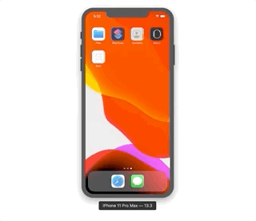
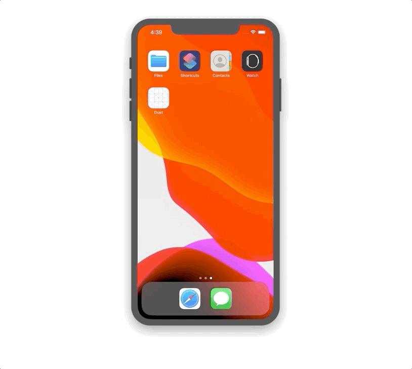

# Dust iOS

**성공 시나리오 데모**

**네트워크 에러 시나리오 데모**

## 단계별 구현 내용

### 가장 가까운 측정소 찾기

> [PR #8 [iOS] 가장 가까운 측정소 찾기][pr1]

* 스토리보드로 UI 구성
* Core Location 프레임워크를 이용한 사용자 위치 정보 획득
* 사용자 위치 정보를 기반으로 서버에 가장 가까운 측정소 요청(현재는 Mock API 기반)

**실행 결과**

### 24시간 미세먼지 정보 표시

> [PR #21 [iOS] 24시간 미세먼지 정보 표시][pr2]

* 측정소 이름으로 24시간 미세먼지 정보 요청
* 실패했을 경우 경고창 표시
* 응답받은 데이터 디코딩시 DateFormatter 활용
* 응답받은 데이터를 테이블뷰 및 상태 뷰에 디스플레이
* 상태 뷰에는 테이블뷰의 가장 위 셀의 데이터 디스플레이

**실행 결과**

### 미세먼지 예보 GIF 이미지 디스플레이

> [PR #30 [iOS] 미세먼지 예보 GIF 이미지 디스플레이][pr3]

* 미세먼지 예보 응답 모델 구현
* 예보 탭 ViewModel 구현 및 서버 응답 받기
* 노티피케이션을 통해 미세먼지 예보 메시지 업데이트
* URL로부터 GIF 데이터 로드
* GIF 재생
* Activity Indicator 추가

**실행 결과**

[pr1]: https://github.com/codesquad-member-2020/dust-7/pull/8
[pr2]: https://github.com/codesquad-member-2020/dust-7/pull/21
[pr3]: https://github.com/codesquad-member-2020/dust-7/pull/30

